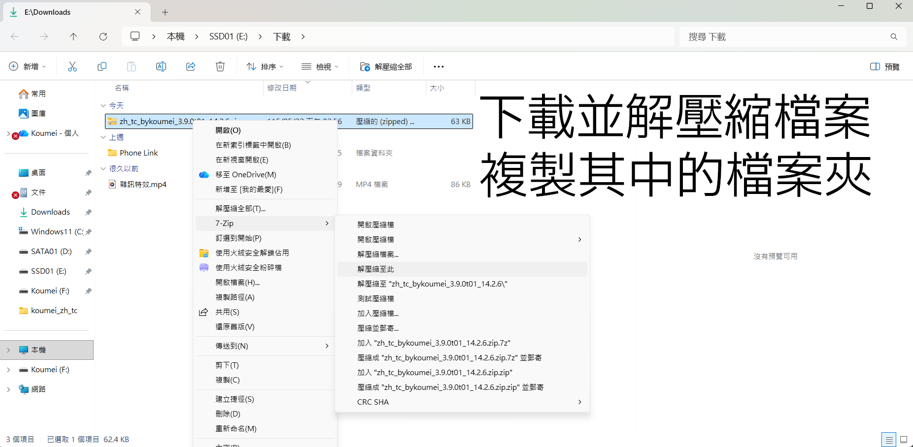
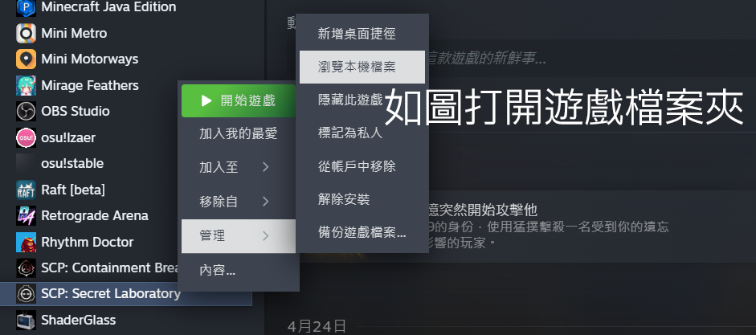
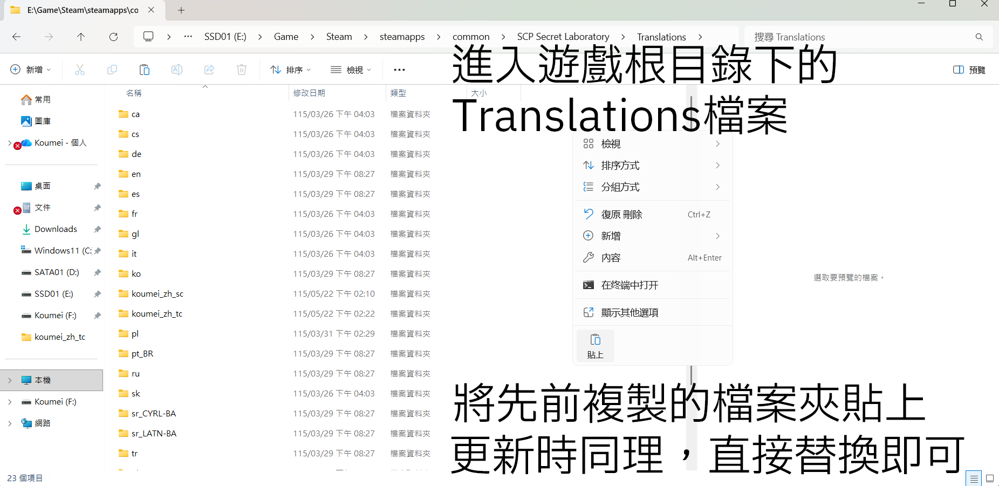
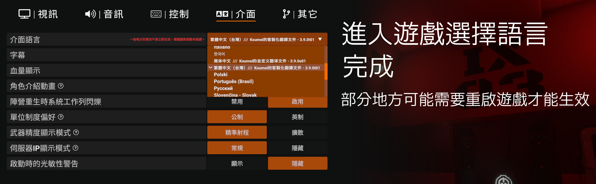

# 🛠️ Koumei的客製化翻譯文件

  使用前請閱讀

  -----------------------------

## ℹ️ 說明

  這是最初基於“SCP:SL Custom Translation Files by Lambda”的中文客製化翻譯檔，目前幾乎所有內容已經與其不同，所以這不是“SCP:SL Custom Translation Files by Lambda”的中文版本！該翻譯檔開放隨意修改及二次分發；該翻譯檔僅供交流使用，因修改或分發所產生的任何問題，請自行承擔風險。
  
  如果你想造訪“SCP:SL Custom Translation Files by Lambda”，[點擊這裡前往](https://github.com/Corporal1Lambda/SCP-SL-Custom-Translation-Files)。

-----------------------------

## 📖 如何使用？

-----------------------------

## 🛜 中國大陸的網路問題
  如果你無法訪問或很難訪問Github，可以加入QQ群聊下載或反饋

  群號739337627
  
  進群代碼0558341

-----------------------------

## ⚖️ 免責聲明

* **非官方文本**：本專案為第三方客製化翻譯檔，與 Northwood Studios（SCP: Secret Laboratory 官方開發團隊）無關。

* **風險自負**：本翻譯檔僅供交流使用。因使用、修改或分發本檔案所產生的任何遊戲崩潰、檔案受損或相關爭議，請自行承擔風險，專案作者概不負責。

* **翻譯版權歸屬**：本檔案的原始中文文本並非由本專案作者翻譯，而是直接採用自遊戲官方中文檔案，原始翻譯者為：Tychus_骁奕、美味水H2O Delicious（來源：manifest.json）。本專案僅在此基礎上進行客製化修改與優化。
