<p align="center">
  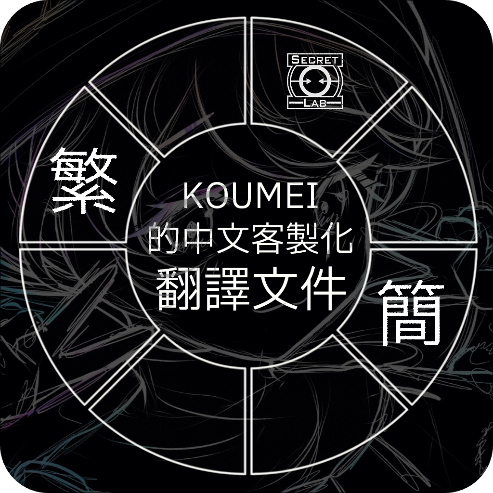
</p>

 # <p align="center">KOUMEI的中文客製化翻譯文件</p>

 <p align="center">由 九霄鵼冥Koumei 製作</p>

[](https://github.com/KoumeiKyuushou/SCP-SL-Custom-Chinese-Translation-Files-by-Koumei-Kyuushou/releases/tag/v3.9.0)
[](https://github.com/KoumeiKyuushou/SCP-SL-Custom-Chinese-Translation-Files-by-Koumei-Kyuushou/releases/tag/previewA3.9.0)
[](https://space.bilibili.com/173589887)
[](https://www.youtube.com/@Koumei-Kyuushou)


# ⚠️ 使用前請閱讀《使用前須知》

  <details>
<summary>點擊展開使用前須知 - 繁體中文</summary>
    
## ℹ️ 說明

  這是最初基於“SCP:SL Custom Translation Files by Lambda”的中文客製化翻譯檔，目前很多內容已經與其不同，並朝著不同方向發展，所以這不是“SCP:SL Custom Translation Files by Lambda”的中文版本！該翻譯檔開放隨意修改及二次分發；該翻譯檔僅供交流使用，因修改或分發所產生的任何問題，請自行承擔風險。
  
  如果你想造訪“SCP:SL Custom Translation Files by Lambda”，[點擊這裡前往](https://github.com/Corporal1Lambda/SCP-SL-Custom-Translation-Files)。
  
<br>

## 📖 如何使用？

1️⃣ 將下載的壓縮檔解壓縮；

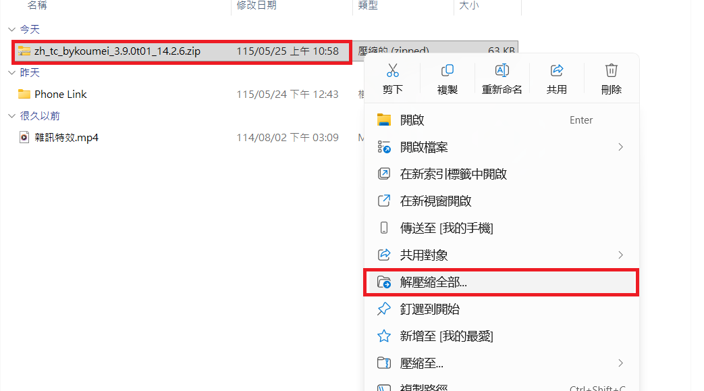

<br>

2️⃣ 解壓縮出來的檔案夾應該叫“koumei_zh_tc”或“koumei_zh_sc”，否則就是被嵌套在了解壓縮檔案夾之中。複製或剪下該檔案；

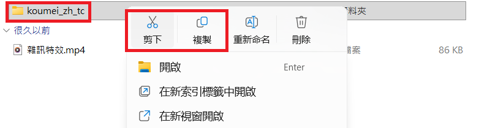

<br>

3️⃣ 在Steam找到SCP: Secret Laboratory右鍵，如圖所示前往 管理 > 瀏覽本機檔案 ；

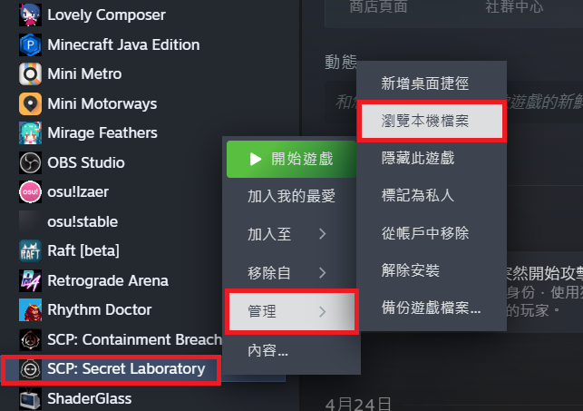

<br>

4️⃣ 在打開的檔案總管視窗中前往Translations檔案夾；

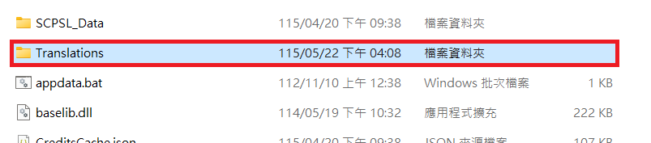

<br>

5️⃣ 右鍵貼上之前複製或剪下的檔案夾，更新時同理，直接覆蓋即可；

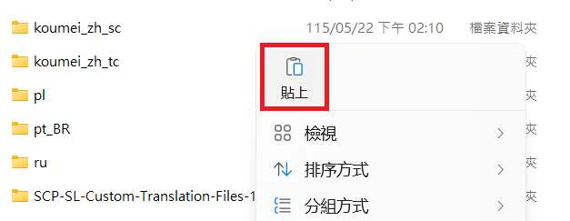

<br>

6️⃣ 在遊戲中修改語言即可，一些地方可能需要重啟遊戲生效。

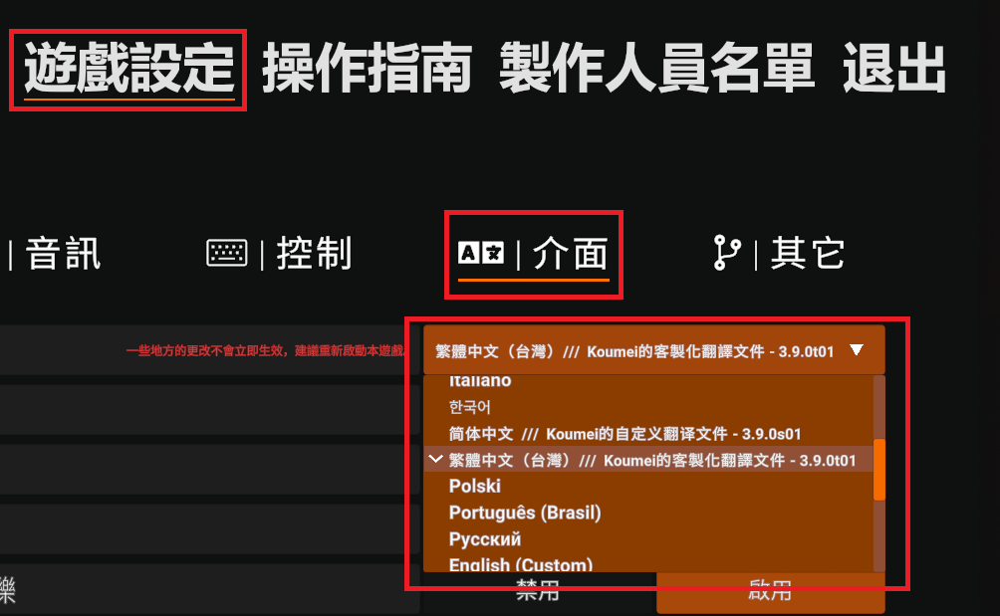

<br>

## 🛜 中國大陸的網路問題
  如果你無法或很難訪問Github，可以加入QQ群聊下載或回報

  群號 **739337627**
  
  進群代碼 **0558341**

<br>

## 🔖 版本與命名

  版本規則如下：
  
  ```
[版本號碼][補丁標識][補丁號碼]_[支援的遊戲版本]
  ```
* **版本號碼**：版本格式為 X.X.X ，第三位採十進位制（滿十進一）；逢重大改動或遊戲小版本變更時，第二位進一且第三位歸零；逢遊戲大版本更新時，則第一位進一，其餘位數同步歸零。

* **補丁標識**：小寫的 t 與 s 字母，前者表示繁體中文（台灣），後者表示簡體中文。
  
* **補丁號碼**：兩位數，當對應語言版本進行了一次獨立修改時加一。
  
* **支援的遊戲版本**：就是遊戲自己的版本號碼。

<br>

  無論如何，翻譯檔案夾的命名永遠為“koumei_zh_tc”或“koumei_zh_sc”。
  
<br>

## ⚖️ 免責聲明

* **非官方檔案**：本專案為第三方客製化翻譯檔，與 Northwood Studios（SCP: Secret Laboratory 官方開發團隊）無關。

* **風險自負**：本翻譯檔僅供交流使用。因使用、修改或分發本檔案所產生的任何遊戲崩潰、檔案受損或相關爭議，請自行承擔風險，專案作者概不負責。

* **翻譯版權歸屬**：本檔案的原始中文文本並非由本專案作者翻譯，而是直接採用自遊戲官方中文檔案，原始翻譯者為：Tychus_驍奕、美味水H2O Delicious（來源：manifest.json）。本專案僅在此基礎上進行客製化修改與優化。

* **無後續更新保證**：本專案由作者利用業餘時間維護，不保證能永久隨遊戲同步更新，亦不承擔必須修復所有問題以及後續相容性問題的義務。**目前狀態：維護中**。

</details>

<br>

  <details>
<summary>点击展开使用前须知 - 简体中文</summary>

## ℹ️ 说明

  这是最初基于“SCP:SL Custom Translation Files by Lambda”的中文自定义翻译文件，目前很多內容已经与其不同，并朝着不同方向发展，所以这不是“SCP:SL Custom Translation Files by Lambda”的中文版本！该翻译文件开放随意修改及二次分发；该翻译文件仅供交流使用，因修改或分发所产生的任何问题，请自行承担风险。
  
  如果你想造访“SCP:SL Custom Translation Files by Lambda”，[点击这里前往](https://github.com/Corporal1Lambda/SCP-SL-Custom-Translation-Files)。

<br>

## 📖 如何使用？

1️⃣ 将下载的压缩包解压；


<br>

2️⃣ 解压出来的文件夹应该叫“koumei_zh_tc”或“koumei_zh_sc”，否则就是被嵌套在解压文件夹之中。复制或剪切该文件夹；


<br>

3️⃣ 在Steam找到SCP: Secret Laboratory右键，如图所示前往 管理 > 浏览本地文件 ；


<br>

4️⃣ 在打开的资源管理器窗口中前往Translations文件夹；


<br>

5️⃣ 右键粘贴之前复制或剪切的文件夹，更新时同理，直接覆盖即可；


<br>

6️⃣ 在游戏中修改语言即可，一些地方可能需要重启游戏生效。


<br>

## 🛜 中国大陆的网络问题
  如果你无法或很难访问Github，可以加入QQ群聊下载或反馈

  群号 **739337627**
  
  进群代码 **0558341**

<br>

## 🔖 版本与命名

  版本规则如下：
  
  ```
[版本号码][补丁标识][补丁号码]_[支援的游戏版本]
  ```
* **版本号码**：版本格式为 X.X.X ，第三位采十进制（满十进一）；逢重大改动或游戏小版本变更时，第二位进一且第三位归零；逢游戏大版本更新时，则第一位进一，其余位数同步归零。
  
* **补丁标识**：小写的 t 与 s 字母，前者表示繁体中文（台湾），后者表示简体中文。
  
* **补丁号码**：两位数，当对应语言版本进行了一次独立修改时加一。
  
* **支援的游戏版本**：就是游戏自己的版本号码。

<br>

  无论如何，翻译文件夹的命名永远为“koumei_zh_tc”或“koumei_zh_sc”。

<br>

## ⚖️ 免责声明

* **非官方文件**：本项目为第三方自定义翻译文件，与 Northwood Studios（SCP: Secret Laboratory 官方开发团队）无关。

* **风险自负**：本翻译文件仅供交流使用。因使用、修改或分发本文件所产生的任何游戏崩溃、文件损坏或相关争议，请自行承担风险，项目作者概不负责。

* **翻译版权归属**：本文件的原始中文文本并非由本项目作者翻译，而是直接采用自游戏官方中文文件，原始翻译者为：Tychus_骁奕、美味水H2O Delicious（来源：manifest.json）。本项目仅在此基础上进行自定义修改与与优化。

* **无后续更新保证**：本项目由作者利用业余时间维护，不保证能永久随游戏同步更新，亦不承担必须修复所有问题以及后续兼容性问题的义务。**目前状态：维护中**。

</details>

<br>

# ❇️ 特點

<details>
<summary>點擊展開</summary>

<br>

* 重生時防止遮擋，但又不失原版訊息。

> _僅限人類，不影響SCP。_


<br>

* 詳細的功能描述與按物品類型的顏色標記，每個SCP物品有獨特顏色標記。

> _詳細的功能來源於[官方Wiki](https://en.scpslgame.com/index.php?title=Main_Page)，可能有誤或過時。_

<table border="0" width="100%">
  <tr>
    <td align="center" width="50%" style="border: none; background: none;">
      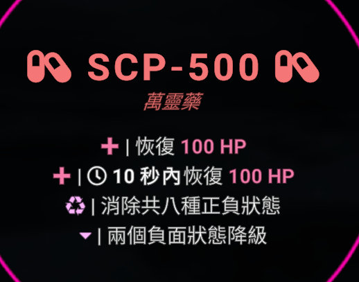
    </td>
    <td align="center" width="50%" style="border: none; background: none;">
      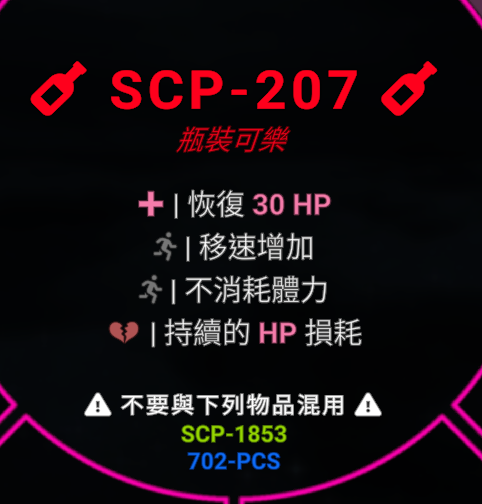
    </td>
  </tr>
</table>

<table border="0" width="100%">
  <tr>
    <td align="center" width="50%" style="border: none; background: none;">
      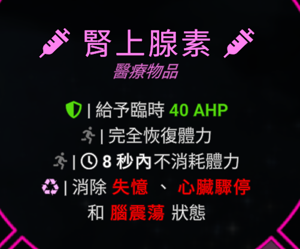
    </td>
    <td align="center" width="50%" style="border: none; background: none;">
      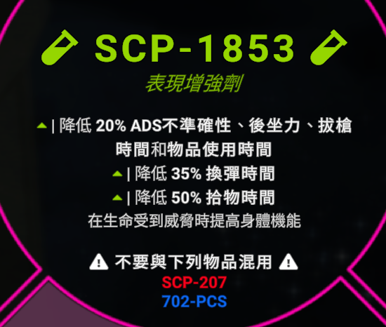
    </td>
  </tr>
</table>

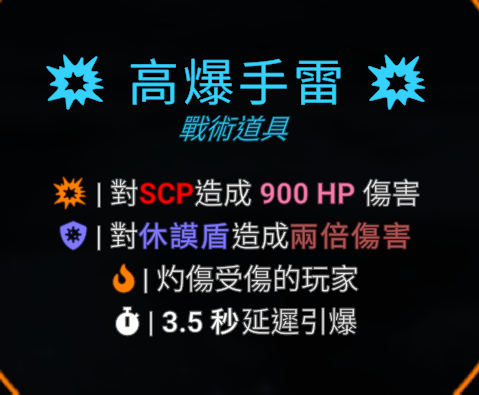

<br>

* SCP的獨特顏色。

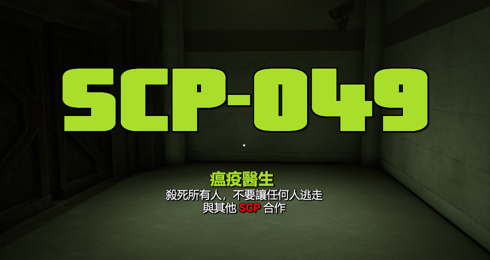

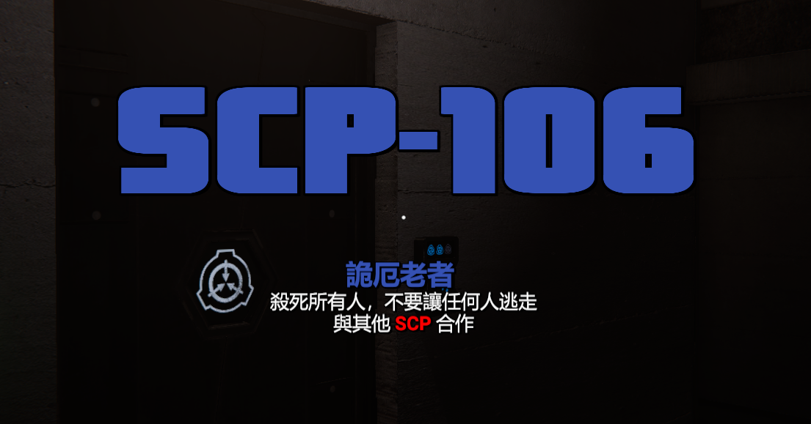

<br>

* 其它一些提示的優化。

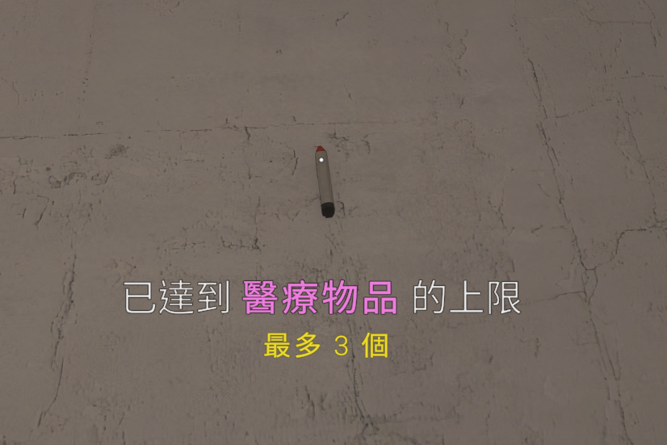

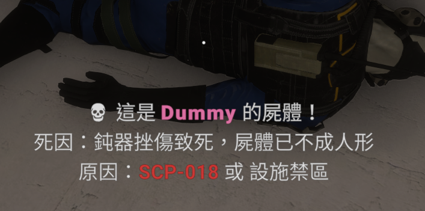

<br>

> _擷取時的翻譯文件版本為 3.9.0_

<br>

</details>

<br>

# ⬇️ 想立即試試嗎？

**繁** [點擊這裡下載最新的 **繁體中文** 版本](https://github.com/KoumeiKyuushou/SCP-SL-Custom-Chinese-Translation-Files-by-Koumei-Kyuushou/releases/download/v3.9.0/zh_tc_bykoumei_3.9.0t01_14.2.6.zip)

**简** [点击这里下载最新的 **简体中文** 版本](https://github.com/KoumeiKyuushou/SCP-SL-Custom-Chinese-Translation-Files-by-Koumei-Kyuushou/releases/download/v3.9.0/zh_sc_bykoumei_3.9.0s01_14.2.6.zip)

<br>

# 🪲 目前已知的問題

### 🔼 高優先

* 被SCP-3114殺死時，屍體死因只顯示SCP-1507或棉花糖人。

> _該問題將在下一個版本解決_

### ⏺️ 中優先

* C.A.S.S.I.E在SCP被收容時讀出了HTML指令的color。

> _原因未知，不知該如何解決_

### 🔽 低優先

* C.A.S.S.I.E廣播文本有延遲。
* 
> _原因已知，要解決只能不要廣播文本的美化_

* 觀眾左側角色文本與F1提示中的角色名字缺失。

> _重生時大名字的隱藏造成了這個問題，如果官方不解決三者文本混用的問題，這個問題永遠無法解決_

<br>

-----------------------------
**貢獻者**

[](https://github.com/KoumeiKyuushou/SCP-SL-Custom-Chinese-Translation-Files-by-Koumei-Kyuushou/graphs/contributors)
